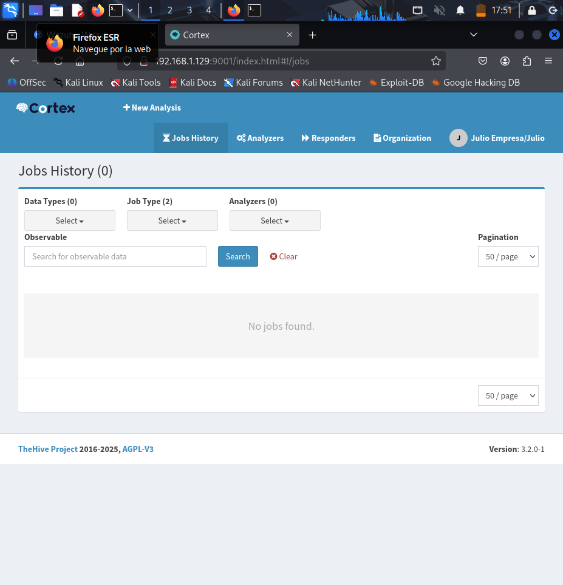

# Capturas CORTEX

En esta sección se muestra cómo se configuró y utilizó Cortex dentro del SOC. Incluye la creación de usuarios, el acceso a la interfaz, y la ejecución de análisis automáticos sobre incidentes o archivos sospechosos. Cada captura refleja los pasos realizados, desde la creación de usuarios hasta la integración con TheHive y MISP para enriquecer los análisis.

