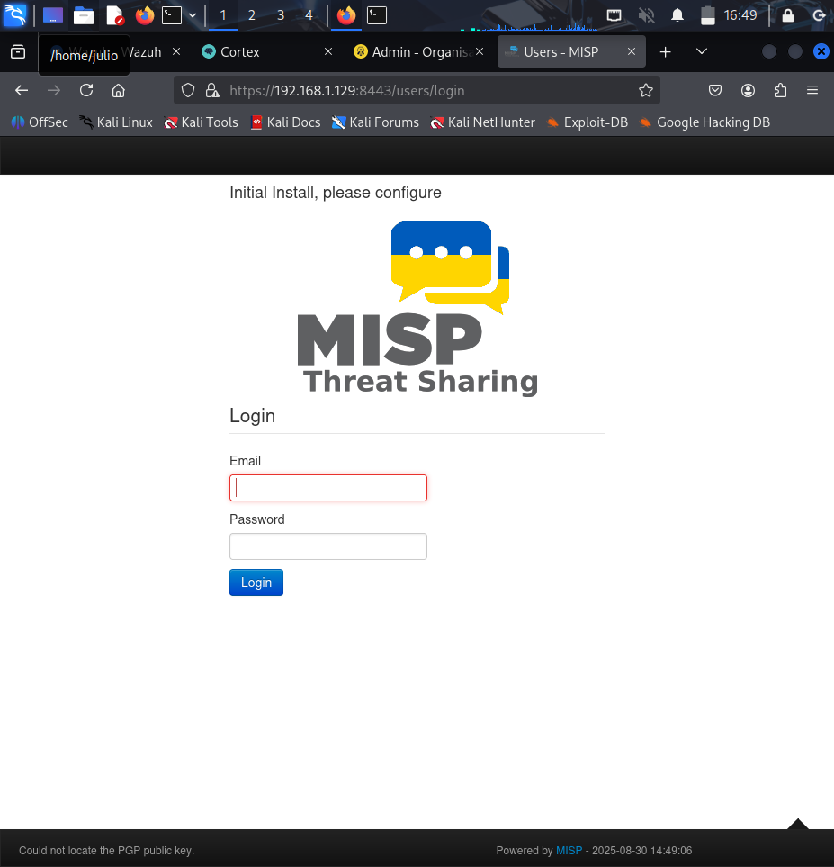
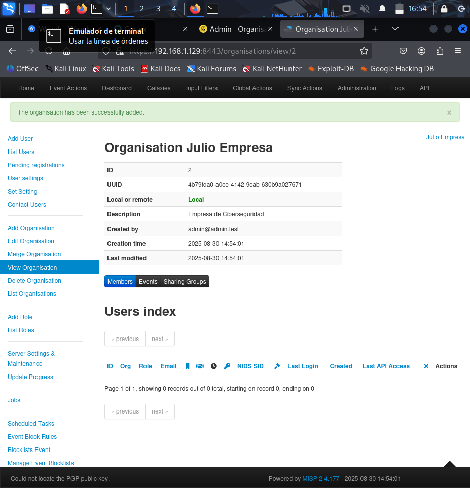
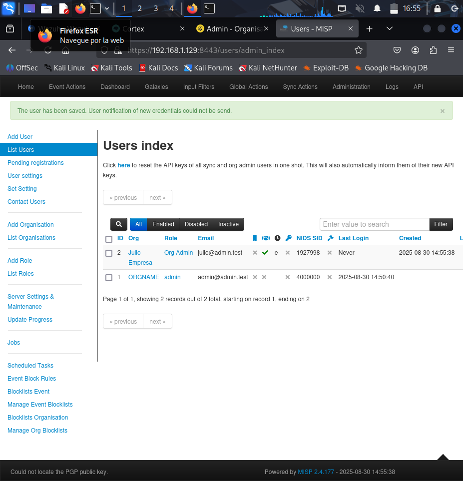
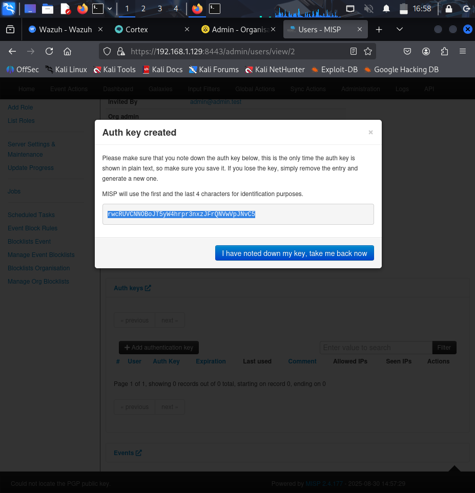

# Capturas MISP

Se detallan los pasos para configurar y utilizar MISP como plataforma de inteligencia de amenazas. Incluye la creación de empresas, usuarios, la obtención de API keys y la sincronización de eventos con TheHive. Cada captura muestra cómo se gestionan los datos y cómo se conecta MISP con el resto de herramientas del SOC.

