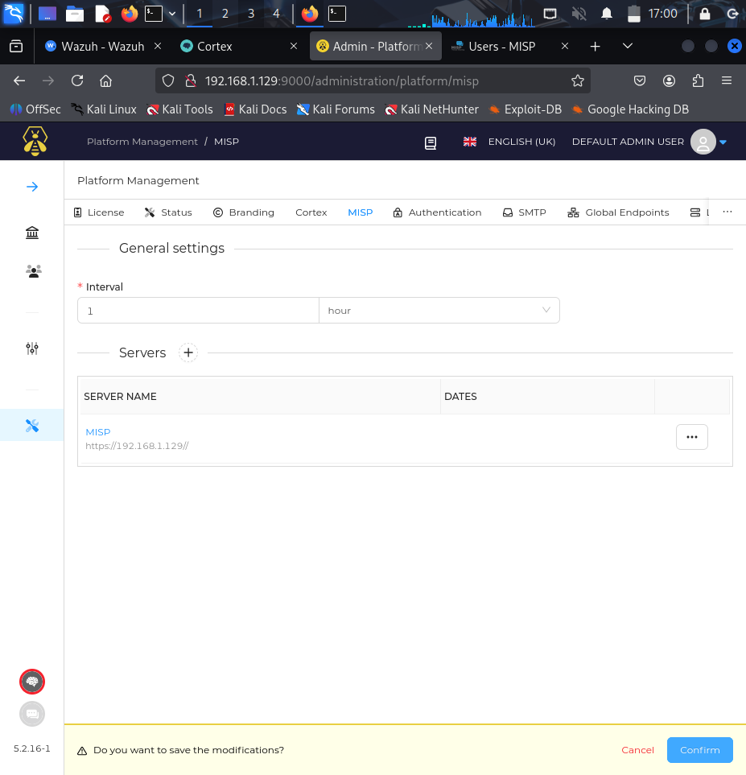
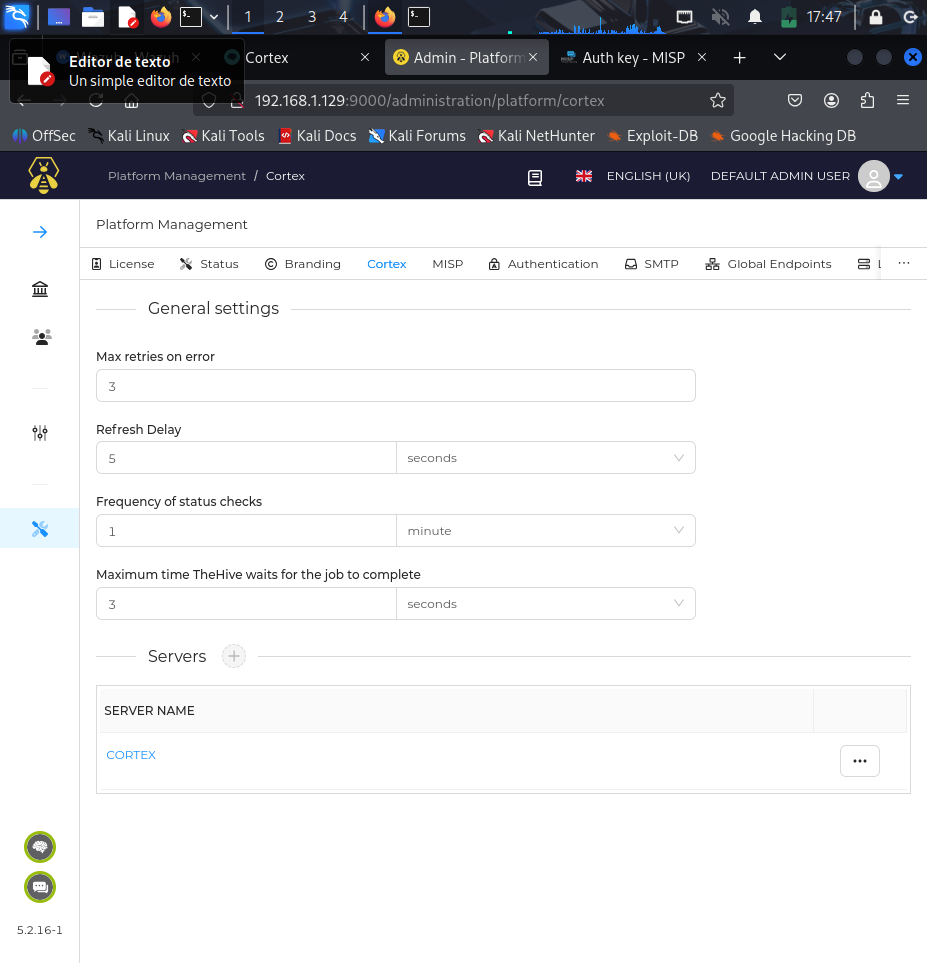
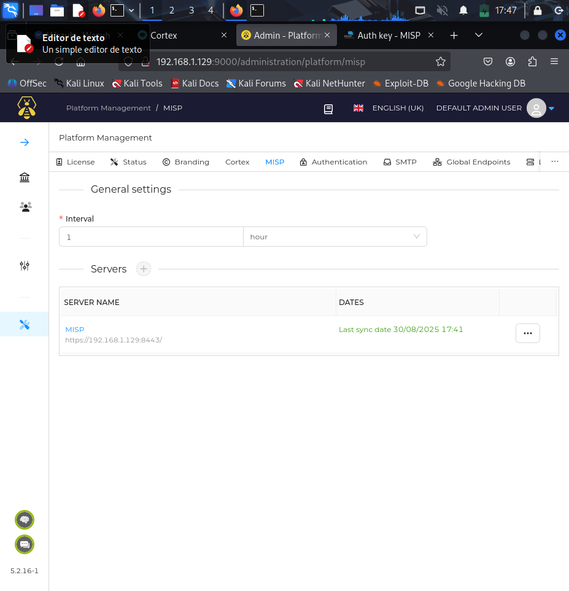
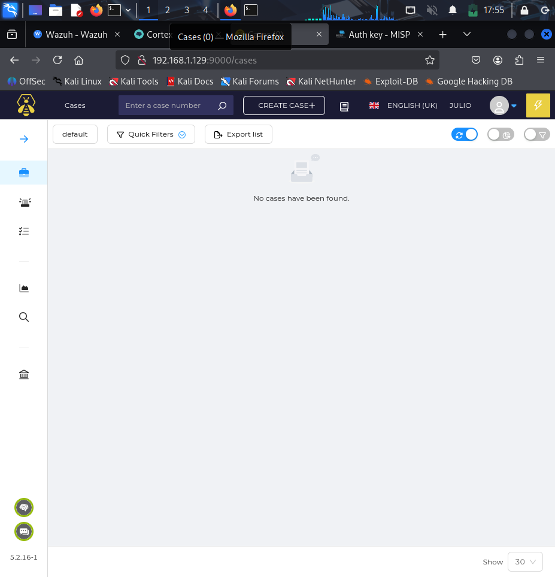

# Capturas THE_HIVE

Se muestran los pasos de configuración y uso de TheHive como gestor central de incidentes. Incluye la creación de empresas y usuarios, la conexión con MISP y Cortex, y la gestión de casos de seguridad. Las capturas reflejan la interacción entre todas las herramientas del SOC y cómo los analistas pueden manejar incidentes de manera eficiente.

