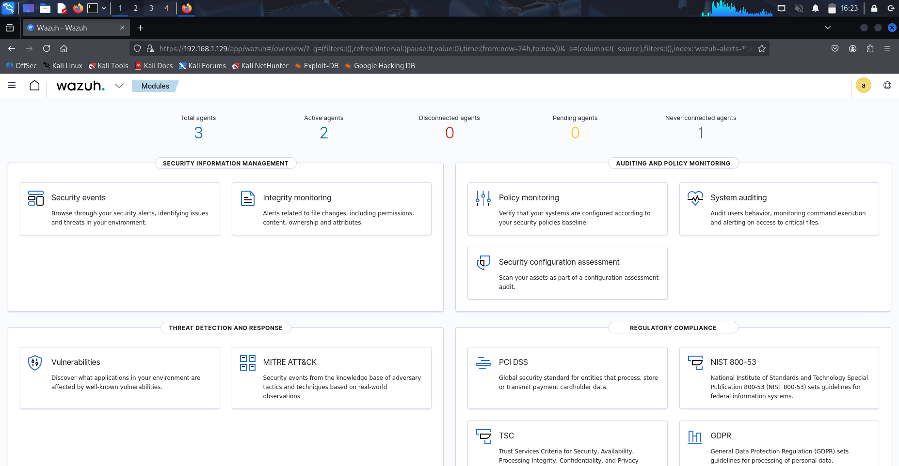
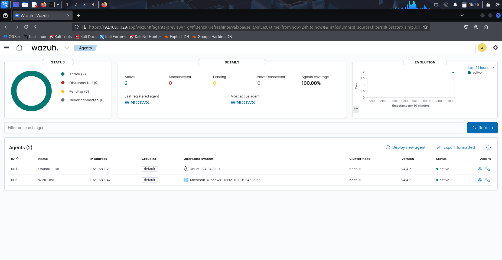
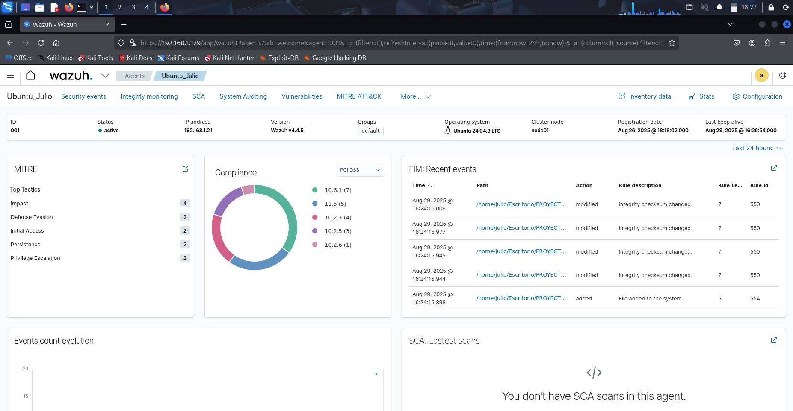
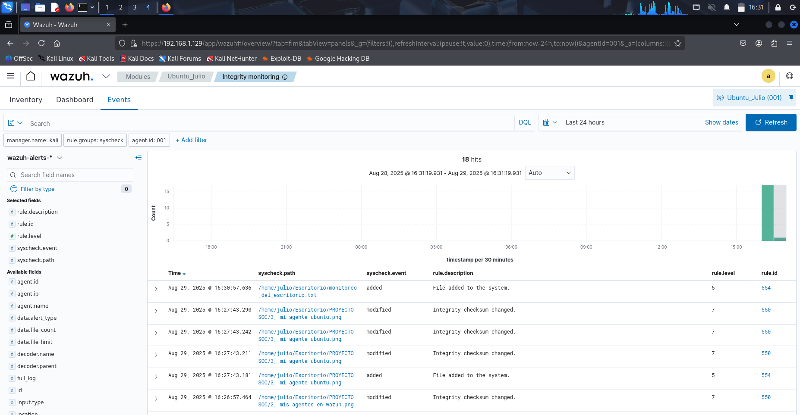
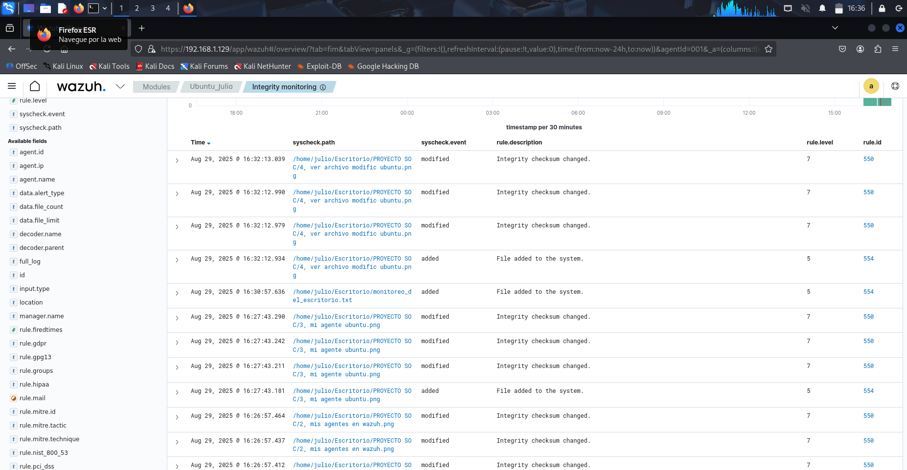
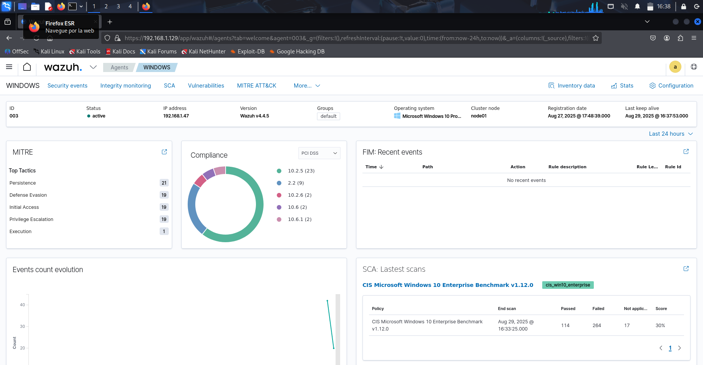
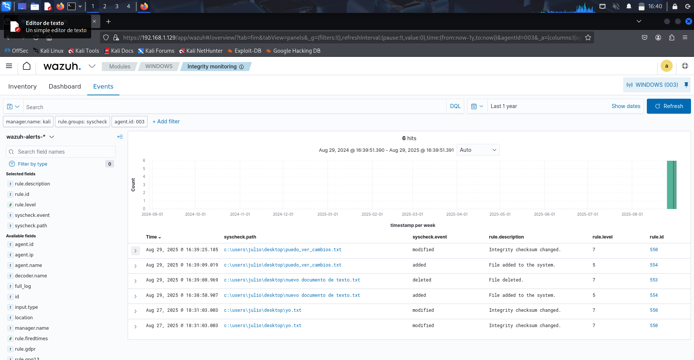
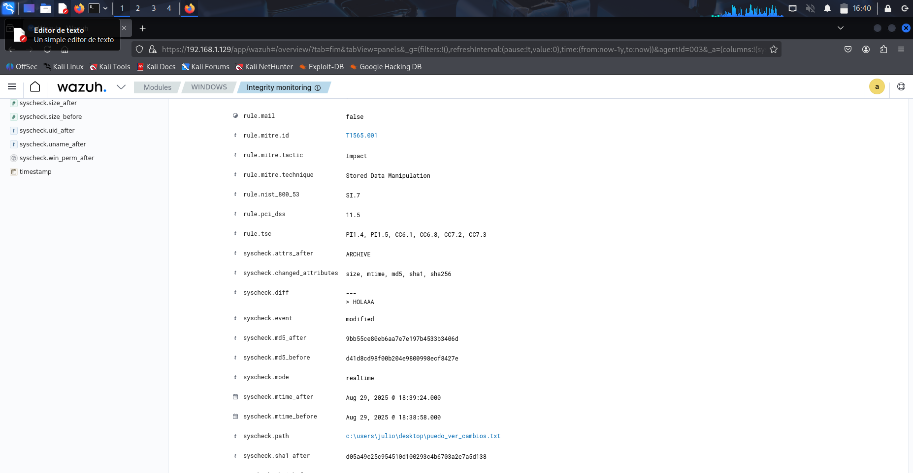

# Capturas WAZUH

Se presentan las capturas del despliegue y monitoreo de Wazuh. Incluye la instalación, la visualización de agentes, la supervisión de archivos modificados, y la integración con TheHive para que las alertas se conviertan automáticamente en incidentes. También se muestran ejemplos de monitoreo en entornos Windows y Linux.

