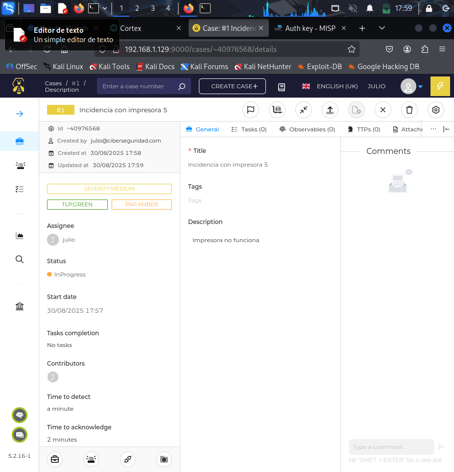
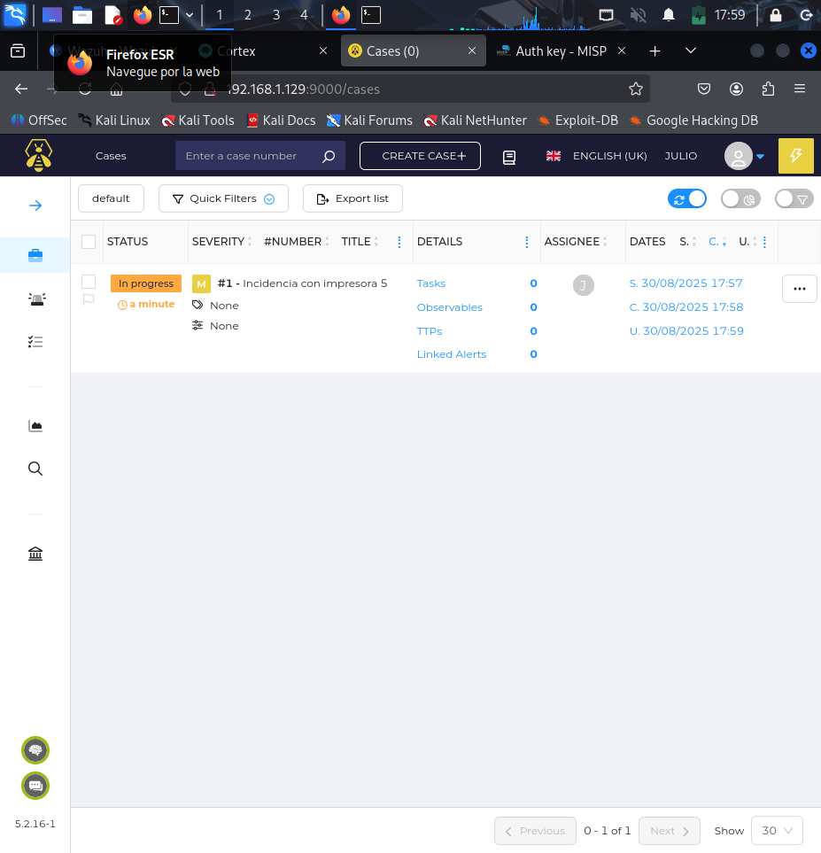

# Capturas flujo

Esta carpeta documenta el flujo completo de incidentes desde su generación hasta su análisis. Las capturas muestran cómo un evento detectado por Wazuh se refleja en TheHive, cómo se crean y gestionan casos, y cómo se ejecutan análisis automáticos con Cortex y se enriquece la información con MISP.

